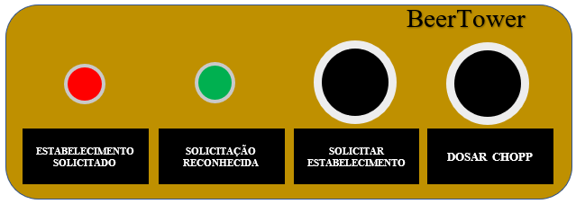

# BeerTower-Chopp

#### Este projeto foi desenvolvido por APOLO DE LIMA (20181610009), EDER MADRUGA COELHO (20181610028), EVERTON JÚNIOR DA SILVA ARRUDA (20181610044) e IVIS FERREIRA DE BRITO (20181610013) na disciplina de Técnicas de Programação (2018.2) tendo como base as aulas ministradas pelo professor PATRIC LACOUTH.

# 1 Introdução

Este protótipo é um primeiro fruto de um projeto de um sistema de dosagem automática a ser implementado em torres de Chopp, onde o usuário através de um push button pode dosar uma quantidade exata do Chopp em seu copo. Além dessa função básica, será implementado outras funções como a informação do nível mínimo da chopeira, bem como a solicitação da substituição da mesma por parte do usuário. Para tanto utilizaremos como controlador o ESP8266, push button, LED's, sensor de temperatura DS18B20 e uma válvula de controle de elaboração própria, contendo um servomotor acoplado a uma válvula manual através de um suporte.

O estabelicimento terá acesso aos clientes através de uma aplicação em QT em comunicação serial com o NODE MCU 8266. Já o cliente por sua vez, terá acesso a temperatura do Chopp, bem como a solicitação do garçom junto a mesa e o andamento desta solicitação, A forma de pagamento e o valor gasto através de uma página WEB que poderá ser acessada com qualquer dispositivo móvel com acesso a internet através de um QR Code.

# 2 Manual do Usuário

## 2.1 Interface do Proprietário (QT)

Primeiramente faz-se necessário setar as configurações de comunicação do software desenvolvido no QT através da aba comunicação.

(PRECISO DE UMA IMAGEM DA ABA COMUNICAÇÃO)

Quando o cliente solicitar uma mesa (chopeira), o responsável pelo estabelecimento vai ocupar a mesa utilizando o programa de acompanhamento realizado no QT.

(IMAGEM DE MESA VAZIA E MESA OCUPADA)

No QT, o responsável pelo estabelecimento vai poder monitorar a temperatura da chopeira para que possa se antecipar ao cliente e manter o chopp sempre gelado

(IMAGEM DE ACOMPANHAMENTO DE TEMPERATURA NO QT)

Se o usuário solicitar a presença do garçom, o QT mostrará a solicitação. Esta solicitação pode ser realizada através do botão físico localizado na chopeira ou através do site de acompanhamento próprio para cada chopeira. Essa Indicação no QT pode ser observada na imagem abaixo.

(IMAGEM DA SOLICITAÇÃO DO CLIENTE NO QT)

Neste momento, um LED acenderá na chopeira indicando que o pedido foi efetuado.
Quando a mensagem de solicitação for reconhecida pelo estabelecimento, outro LED deverá acender informando que a solicitação foi reconhecida pelo estabelecimento.

Isto também poderá ser observado através do site próprio da chopeira.

## 2.2 Interface do Usuário (Botões físicos e Web)

O usuário  terá duas formas de interface com a chopeira e com o estabelecimento. 

### Interface Física

A primeira, através da interface física localizada na própria chopeira que contem:
- Um botão para dosagem do chopp
- Um botão para solicitação ao estabelecimento
- Um LED para informar que uma solicitação foi realizada
- Um LED para informar que a solicitação foi reconhecida pelo estabelecimento

Na Imagem abaixo, podemos ver um exemplo a ser implementada dessa interface física.

A outra Interface é utilizando a interface WEB que pode ser acessada através de qualquer dispositivo que possua acesso a Internet (Própria do estabelecimento ou 3G)

(IMAGEM DA INTERFACE WEB)

Aqui o usuário terá acesso a temperatura do Chopp, no campo mostrado na figura abaixo. 

(IMAGEM DO MONITORAMENTO DA TEMPERATURA)

A interface também possui um botão para solicitação ao estabelecimento, que igualmente ao botão físico irá acender o LED de solicitação, e após o reconhecimento por parte do estabelecimento o LED de reconhecimento. Também na WEB é possível ver o Status da solicitação.

(IMAGEM BOTÃO + STATUS NA WEB)

Também via Interface WEB é possível encerrar a conta do cliente.

(IMAGEM WEB ENCERRAR CONTA)

# 3 Do outro Lado do Protótipo

O desenvolvimento lógico do protótipo BeerTower-Chopp contém três segmentos básicos:

- O NodeMCU 8266: Que fará o controle dos dispositivos eletrônicos. Na figura abaixo podemos ver a conexão destes dispositivos utilizados no protótipo.

- A Interface do Estabelecimento: Desenvolvido através do QT Creator.

- A Interface do Cliente: Página WEB que poderá ser acessada pelo usuário.

