# BeerTower-Chopp

#### Este projeto foi desenvolvido por APOLO DE LIMA (20181610009), EDER MADRUGA COELHO (20181610028), EVERTON JÚNIOR DA SILVA ARRUDA (20181610044) e IVIS FERREIRA DE BRITO (20181610013) na disciplina de Técnicas de Programação (2018.2) tendo como base as aulas ministradas pelo professor PATRIC LACOUTH.

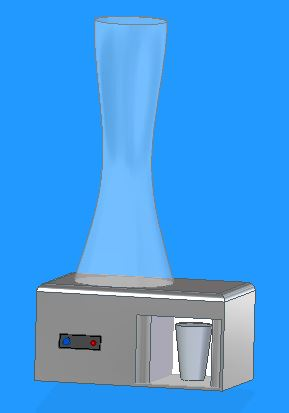

# 1 Introdução

Este protótipo é um primeiro fruto de um projeto de um sistema de dosagem automática a ser implementado em torres de Chopp, onde o usuário através de um push button pode dosar uma quantidade exata do Chopp em seu copo. Além dessa função básica, será implementado outras funções como a informação do nível mínimo da chopeira, bem como a solicitação da substituição da mesma por parte do usuário. Para tanto utilizaremos como controlador o ESP8266, push button, LED's, sensor de temperatura DS18B20 e uma válvula de controle de elaboração própria, contendo um servomotor acoplado a uma válvula manual através de um suporte.

O estabelicimento terá acesso aos clientes através de uma aplicação em QT em comunicação serial com o NODE MCU 8266. Já o cliente por sua vez, terá acesso a temperatura do Chopp, bem como a solicitação do garçom junto a mesa e o andamento desta solicitação, A forma de pagamento e o valor gasto através de uma página WEB que poderá ser acessada com qualquer dispositivo móvel com acesso a internet através de um QR Code.

# 2 Manual do Usuário

## 2.1 Interface do Proprietário (QT)

A Interface do proprietário do estabelecimento é composto de três abas conforme mostra a figura a seguir:

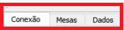

Na figura, podemos destacar as abas mencionadas:

- Aba Conexão: Responsável por estabelecer os dados de conexão com a placa controladora (NODE MCU 8266)
- Aba Mesas: Aqui o proprietário poderá ocupar e desocupar as mesas, bem como informar a quantidade de chopeiras solicitadas. Esta informação será útil para disponibilizar ao usuário, via WEB, o valor consumido (referente a torres de chopp).
- Aba Dados: Nesta aba, o proprietário poderá verificar a temperatura do chopp, se existe alguma solicitação, bem como um histórico.

### Estabelecendo a conexão

Estando na aba conexão, inicialmente, o status da conexão estará mostrando "Desconectado".

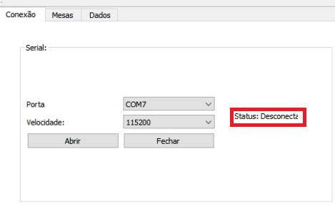

Para estabelecer uma comunicação com a placa controladora, é necessário escolher a porta de comunicação em que a placa foi conectada.

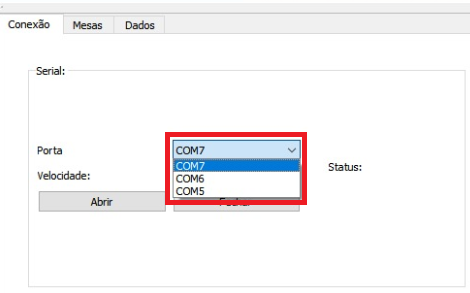

Depois devemos escolher a velocidade de comunicação, como podemos ver na figura abaixo.

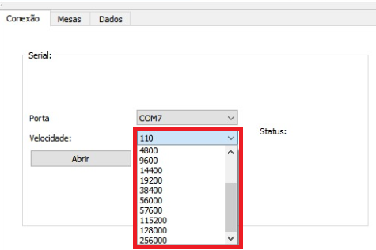

Por padrão, a velocidade escolhida deverá ser de 115000.

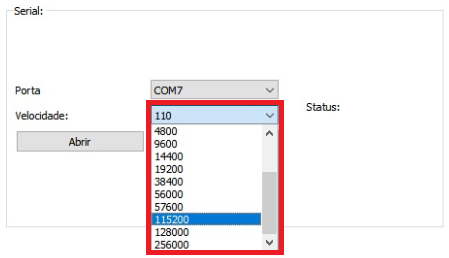

Uma vez que os dados de conexão foram estabelecidos, devemos acionar o botão abrir.

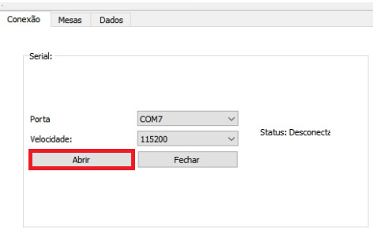

Se tudo ocorrer como previsto, o Status da conexão mudará para "Conectado".

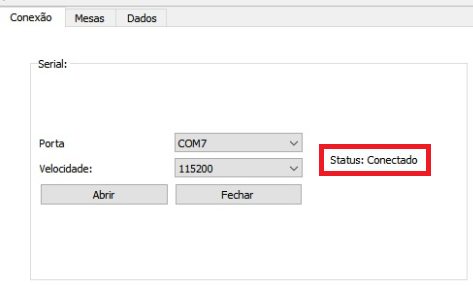

### Estabelecendo a Mesa do Cliente

Uma vez que a conexão foi estabelecida com sucesso, devemos estabelecer a mesa que está sendo utilizada pelo ciente.

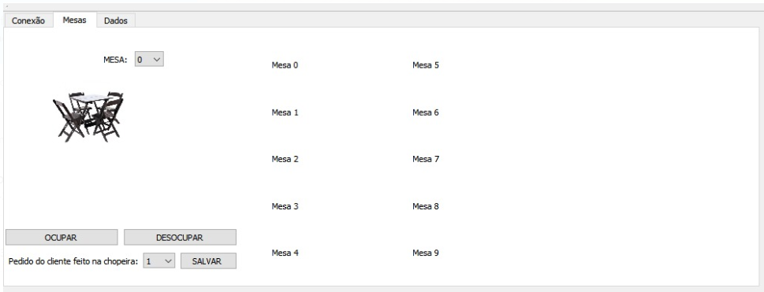

Para tanto, selecionamos a mesa e acionamos "Ocupar". 

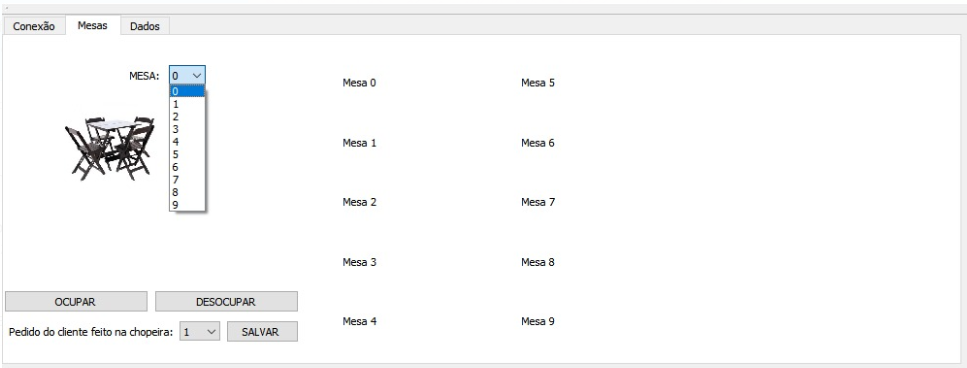

Dessa forma, no campo indicado para a mesa aparecerá uma imagem indicando que a mesa foi ocupada. Na figura abaixo, podemos ver as mesas ocupadas.

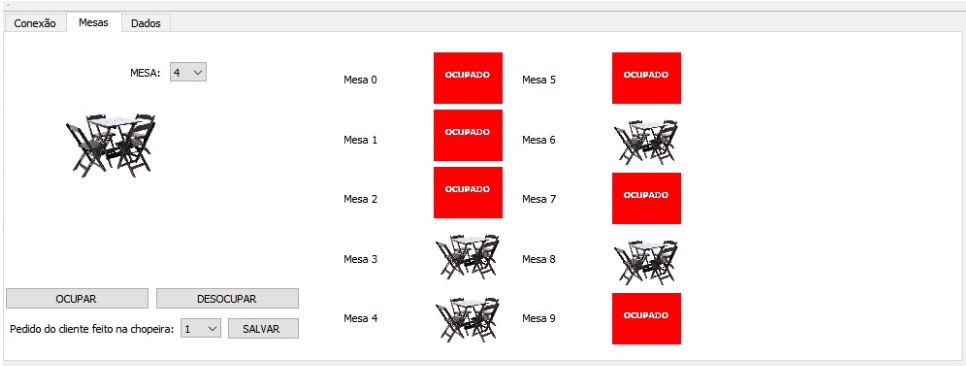

Para mudar o status da mesa para livre, é necessário acionar o botão desocupar.

Na mesma aba é possível setar a quantidade de chopeiras que foi disponibilizado ao cliente. Para tanto, selecionamos a quantidade e acionamos o botão "Salvar".

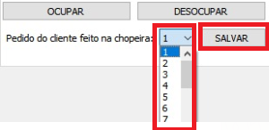

Esta informação será útil para disponibilizar ao cliente a informação do valor gasto, em termos de chopeiras.

### Verificando os dados da Mesa / Chopeira

Agora, podemos acessar a Aba "Dados".

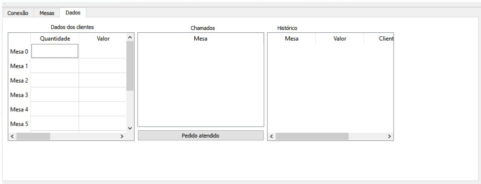

A primeira informação, diz respeito ao valor gasto pelo cliente em termos de chopeiras, como podemos ver na figura abaixo.

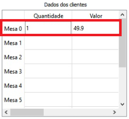

Essa informação só foi possível devido a informção sobre a quantidade de chopeiras na aba Mesas.

Depois podemos verificar a temperatura do chopp na mesa do cliente.

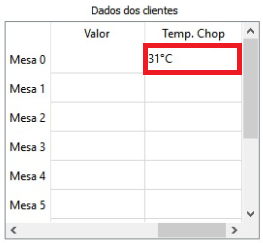

Essa é uma importante informação, pois possibilita que o proprietário do estabelecimento se antecipe ao cliente e troque o refil que mantém a temperatura do chopp.

Também é possível verificar se algum cliente solicitou atendimento, caso positivo aparecerá a mesa cujo atendimento foi solicitado. Essa solicitação, poderá ser feita através de um botão físico na chopeira ou via interface WEB.

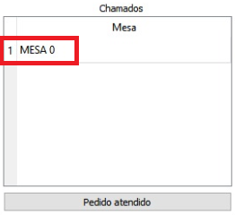

Uma vez que a solicitação foi enviada, um LED "Chamado" acenderá na chopeira e a indicação aparecerá no software do proprietário. Uma vez que o pedido foi atendido, o proprietário deverá selecinar a linha em que o atendimento foi solicitado. Essa linha então ficará azul.

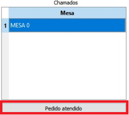

Ao pressionar o botão "Pedido Atendido", o solicitação será excluída e o LED "Chamado" da chopeira piscará por 5 vezes e então apagará. Uma nova solicitação poderá ser relaizada.

Por fim, é possível acompanhar um histórico na mesma aba.

## 2.2 Interface do Usuário (Botões físicos e Web)

O usuário  terá duas formas de interface com a chopeira e com o estabelecimento. 

### Interface Física

A primeira, através da interface física localizada na própria chopeira que contem:
- Um botão para dosagem do chopp
- Um botão para solicitação ao estabelecimento
- Um LED para informar que uma solicitação foi realizada
- Um LED para informar que a solicitação foi reconhecida pelo estabelecimento

Na Imagem abaixo, podemos ver um exemplo a ser implementada dessa interface física.

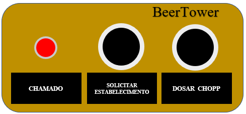

A outra Interface é utilizando a interface WEB que pode ser acessada através de qualquer dispositivo que possua acesso a Internet (Própria do estabelecimento ou 3G)

(IMAGEM DA INTERFACE WEB)

Aqui o usuário terá acesso a temperatura do Chopp, no campo mostrado na figura abaixo. 

(IMAGEM DO MONITORAMENTO DA TEMPERATURA)

A interface também possui um botão para solicitação ao estabelecimento, que igualmente ao botão físico irá acender o LED de solicitação, e após o reconhecimento por parte do estabelecimento o LED de reconhecimento. Também na WEB é possível ver o Status da solicitação.

(IMAGEM BOTÃO + STATUS NA WEB)

Também via Interface WEB é possível encerrar a conta do cliente.

(IMAGEM WEB ENCERRAR CONTA)

# 3 Do outro Lado do Protótipo

O desenvolvimento lógico do protótipo BeerTower-Chopp contém três segmentos básicos:

- O NodeMCU 8266: Que fará o controle dos dispositivos eletrônicos. Na figura abaixo podemos ver a conexão destes dispositivos utilizados no protótipo.

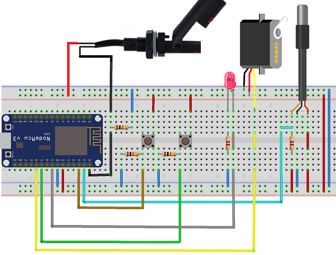

- A Interface do Estabelecimento: Desenvolvido através do QT Creator.

- A Interface do Cliente: Página WEB que poderá ser acessada pelo usuário.

## 3.1 Comunicação entre os Dispositivos - Protocolo

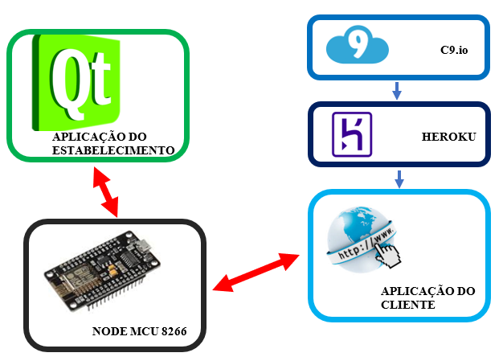

A comunicação entre os diversos componentes do projeto está baseada no protocolo Json.

JSON (JavaScript Object Notation) é um formato leve de troca de dados. É fácil para programadores ler e escrever. É fácil para as máquinas analisar e identificar. JSON é um formato de texto completamente independente do idioma, mas utiliza convenções que são familiares aos programadores da família C de linguagens, incluindo C, C ++, C #, Java, JavaScript, Perl, Python e muitos outros. Essas propriedades tornam o JSON uma linguagem de intercâmbio de dados ideal.

Nesse projeto, utilizamos a o JSON construído por pares nome / valor. Em vários idiomas, isso é realizado como um objeto, registro, estrutura, dicionário, tabela de hash, lista com chave ou matriz associativa.
Faz sentido que um formato de dados que seja intercambiável com linguagens de programação também seja baseado nessas estruturas.

No JSON, um objeto é um conjunto não ordenado de pares nome / valor. Um objeto começa com {  (chave esquerda) e termina com }  (chave direita) . Cada nome é seguido por :  e o nome / pares de valores estão separados por ,  (vírgula) .

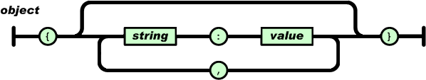

